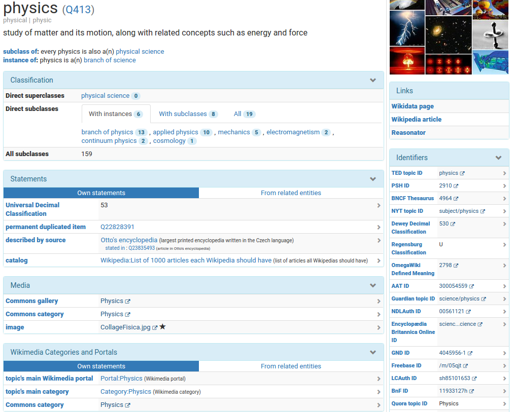
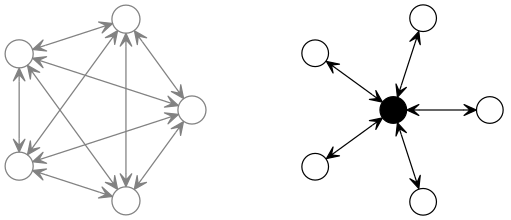

{width=40%}

* Knowledge Base für Wikipedia u.A.
* Offene Bearbeitung
* Open Data (APIs & Downloads)

---

{width=100%}

# Normdaten-Identifier in Wikidata

* 3426 Wikidata-Properties insgesamt
* 1758 Datentyp external identifier
* 1555 [Properties for authority control](https://www.wikidata.org/wiki/Q18614948)
* 200 Properties mit explizit entsprechendem KOS
    * 60 davon in BARTOC eingetragen, z.B.\
      GND (Q36578)\
      Wikidata-Eigenschaft (P1687)\
      GND-ID (P227)
* 10816 KOS insgesamt

# Wikidata als Linking Hub

{width=100%}

# Eintragung von Mappings in Wikidata

* Viele freiwillige Wikidata-Autoren
* Aus vorhandenen Konkordanzen

*=> Siehe Vorträge auf DINI-AG KIM Workshop und ELAG 2017*

# Bereitstellung von Wikidata-Mappings

<http://coli-conc.gbv.de/concordances/wikidata/>

* Tägliches Harvesting aus Wikidata
* Bereitstellung als CSV, BEACON & JSKOS
* Berechnung der Überlappungen = indirekte Mappings
* Logfiles

# Aktueller Stand (8. Mai 2017)

* 46 KOS (plus 14 ohne Download)
* 2,3 Millionen Mappings mit Wikidata
    * 1 Millionen VIAF, 470.000 GND ...
    * 4270 DDC, 103 RVK ...
    * ...
* 1 Millionen indirekte Mappings über Wikidata
    * 434.748 VIAF <-> GND
    * 6522 DDC <-> ...
    * 181 RVK <-> ...
    * 52 DDC <-> RVK 
    * ...

# Nächste Schritte

* Bereitstellung in Mapping-Datenbank zur Abfrage in JSKOS
* Weitere Auswertung der Mappings aus Wikidata
* Weitere Anreicherung von Wikidata
    * zusätzliche Mappings (z.B. VIAF <-> GND, DDC <-> RVK ...)
    * zusätzliche Properties (z.B. STW, BK...)
   
# Weitere Informationen

* Neubert, Joachim; Voß, Jakob: Wikidata as authority linking hub. <https://doi.org/10.5281/zenodo.572608> (Vortragsfolien)

* Voß, Jakob: Classification of Knowledge Organization Systems with Wikidata. In: Proceedings of the 15th European Networked Knowledge Organization Systems Workshop (NKOS 2016), p 15-22. CEUR Workshop Proceedings, Volume 1676. <http://ceur-ws.org/Vol-1676/paper2.pdf>

* <https://github.com/gbv/cocoda-mappings> (Quellcode)

* <https://wdmapper.readthedocs.io/> (Tool)
